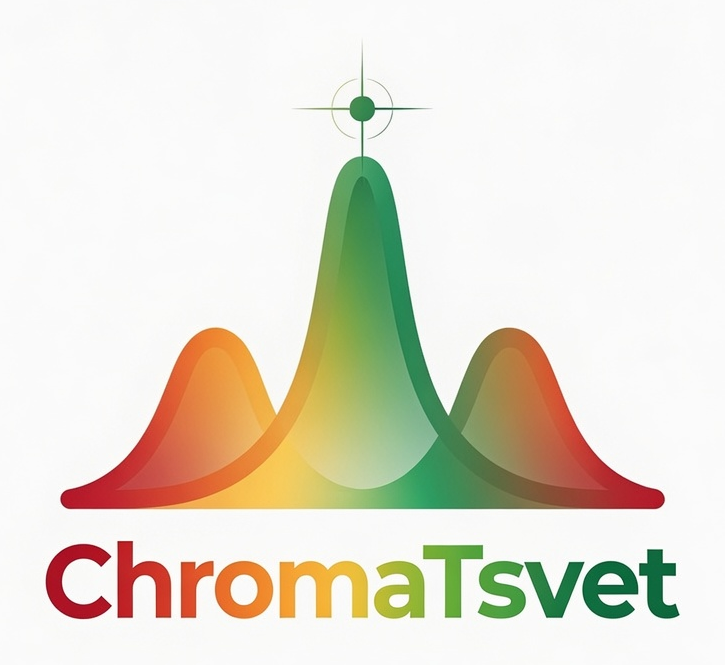
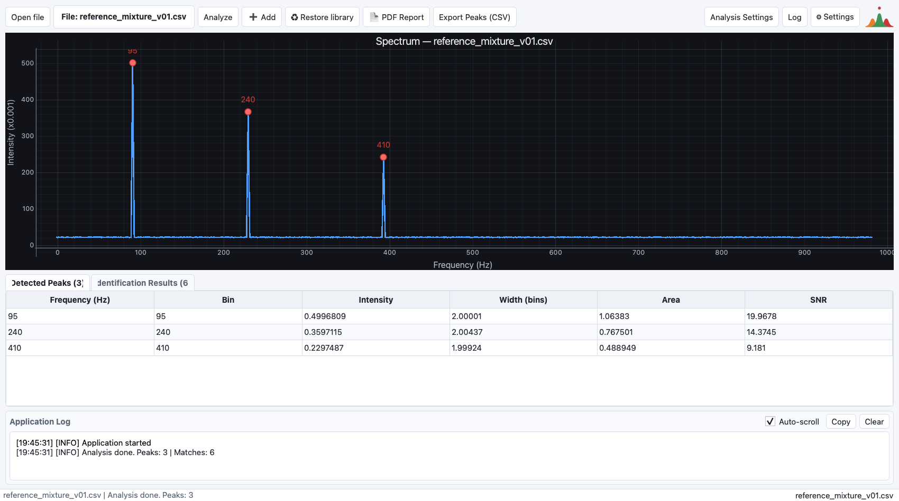
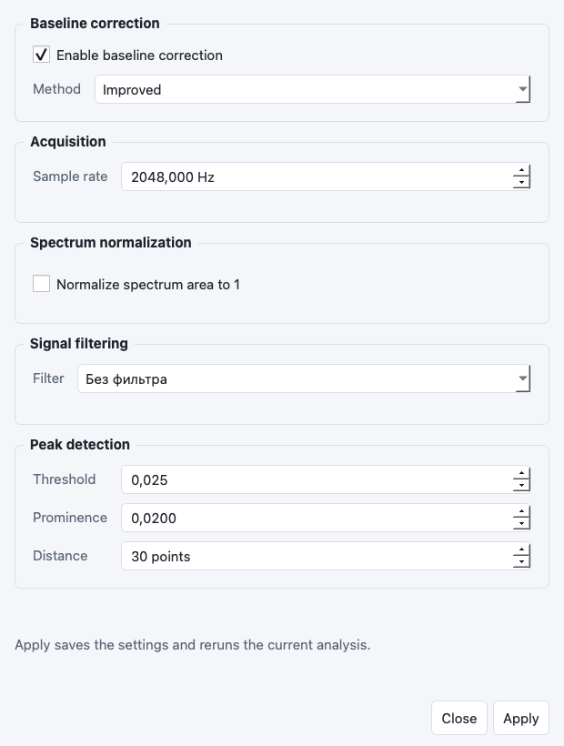
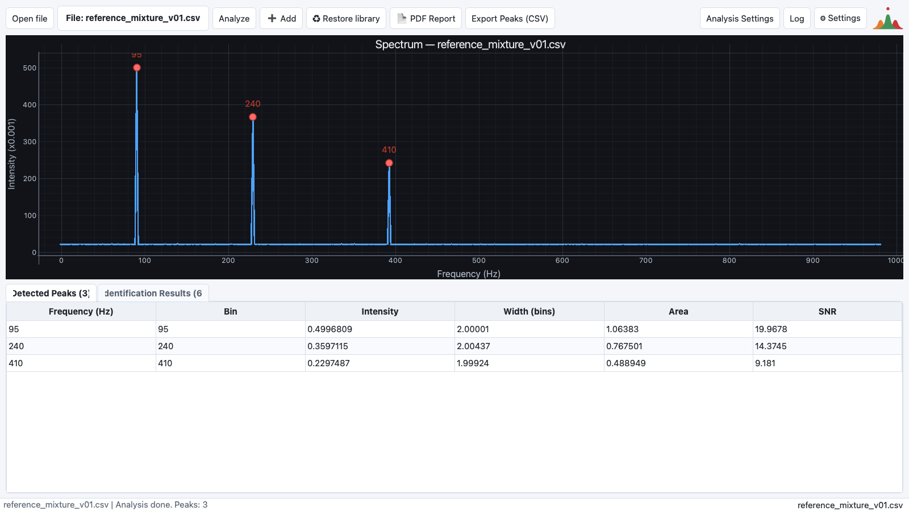
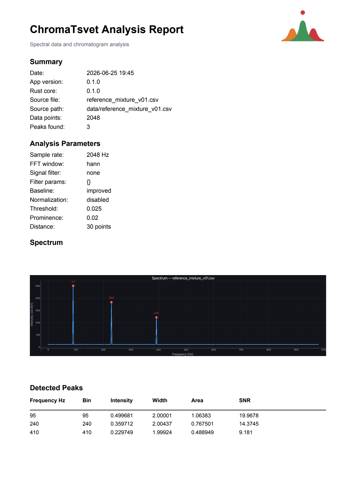

<p align="right"><a href="README.ja.md">日本語</a></p>

<p align="center">
  
</p>

<h1 align="center">ChromaTsvet</h1>

<p align="center">
  A desktop application for loading, processing, visualizing, and identifying
  spectral data and chromatograms.
</p>

<p align="center">
  <a href="https://github.com/pinkprincess766/ChromaTsvet/actions/workflows/ci.yml"></a>
  
  
  
  <a href="LICENSE"></a>
</p>



ChromaTsvet combines a PyQt desktop interface with a Rust/PyO3 signal-processing
core. It is designed as a practical, inspectable foundation for scientific
signal analysis rather than a black-box workflow. The name honors Mikhail
Semyonovich Tsvet, the botanist who invented chromatography.

## Project Status

ChromaTsvet v0.1.0 is a first public, source-based release. It is ready for
local experiments, demonstrations, and iterative scientific tooling work, but it
is not yet a validated laboratory instrument. Continuous integration runs the
Python and Rust test suites. Peak-based identification is now available as an
inspectable baseline with legacy cosine matching kept as a compatibility
fallback; packaged installers and richer reference-library workflows are planned
after v0.1.

## Highlights

- Load numeric spectral or chromatographic data from CSV and TXT files.
- Apply median or Savitzky-Golay signal filtering, optional spectrum smoothing, and baseline correction.
- Calculate an FFT spectrum using a configurable sample rate and frequency axis.
- Normalize a spectrum by integral area when comparable intensity scaling is needed.
- Detect peaks with threshold, prominence, distance, and SNR controls; calculate frequency, intensity, FWHM width in bins/Hz, Gaussian area, and SNR.
- Inspect detected peaks in the plot and in a detailed analysis table.
- Zoom into the spectrum with the mouse.
- Compare spectra against a local SQLite reference library.
- Export detected peaks with analysis metadata to CSV and complete analysis results to PDF.
- Use light and dark application themes.

## Screenshots

<table>
  <tr>
    <td width="50%"><strong>Analysis settings</strong></td>
    <td width="50%"><strong>Detected peaks</strong></td>
  </tr>
  <tr>
    <td></td>
    <td></td>
  </tr>
  <tr>
    <td colspan="2"><strong>PDF analysis report</strong></td>
  </tr>
  <tr>
    <td colspan="2" align="center"></td>
  </tr>
</table>

The release screenshots use a deterministic demonstration signal containing
components at 95 Hz, 240 Hz, and 410 Hz. They can be regenerated with
`tools/capture_release_screenshots.py`; the PNG files are intended for the
README and GitHub release notes. Regenerating the PDF preview requires either
`pypdfium2` or Poppler's `pdftoppm`.

## Getting Started

### Prerequisites

- Python 3.9 or newer
- A current Rust toolchain with Cargo
- Platform build tools required by PyO3

### Build and run from source

```bash
git clone https://github.com/pinkprincess766/ChromaTsvet.git
cd ChromaTsvet

python3 -m venv .venv
source .venv/bin/activate
python -m pip install --upgrade pip
python -m pip install maturin
python -m pip install -e .

cd rust_module
maturin develop
cd ..

python python_analyzer/main.py
```

On Windows, activate the environment with:

```bat
.venv\Scripts\activate
```

Then run the same `pip`, `maturin develop`, and application commands from the
activated environment. The application starts without demo data; use **Open
file** to load a CSV or TXT spectrum.

## Input Data

The simplest supported file contains one intensity value per line:

```text
intensity
0.12
0.35
1.42
0.48
```

Headerless two-column files are also supported; the second column is interpreted
as intensity. Named table columns such as `intensity`, `amplitude`, `signal`,
`value`, or `absorbance` are detected automatically. CSV files may use comma,
semicolon, or tab delimiters.

After loading a file, set the correct sample rate in **Analysis Settings**. The
sample rate is required to convert FFT bins into physical frequency values.

## Typical Workflow

1. Open a CSV or TXT signal file.
2. Configure sample rate, filtering, spectrum smoothing, baseline correction, and peak-detection parameters.
3. Run the analysis and inspect marked peaks on the frequency plot.
4. Review peak frequency, intensity, width in bins/Hz, area, and SNR in the results table.
5. Export the peak list as CSV or generate a PDF analysis report.

## Development

Run the Python test suite from the project root:

```bash
QT_QPA_PLATFORM=offscreen python -m unittest discover -v
```

Run the Rust unit tests:

```bash
cd rust_module
cargo test
```

Regenerate the v0.1 PNG screenshot set:

```bash
QT_QPA_PLATFORM=offscreen python tools/capture_release_screenshots.py
```

See [Development Notes](docs/development.md) for the current maturin workflow
and performance profiling procedure. See [Peak-Based Identification](docs/identification.md)
for the current peak-based matcher and legacy cosine fallback behavior.

## Architecture

```text
python_analyzer/
  main.py                    Thin bootstrap and compatibility facade
  gui/main_window.py         MainWindow orchestration, state, exports
  gui/dialogs.py             Settings, analysis settings, and log dialogs
  gui/theme.py               Qt palette and stylesheet helpers
  gui/log_view.py            Shared log-view formatting
  analysis/models.py         AnalysisSettings and LoadedSpectrum dataclasses
  analysis/runner.py         Filter -> Rust pipeline wrapper
  exporters/peak_csv.py      Detected peak CSV export
  readers/spectrum_reader.py CSV/TXT spectrum parsing
  viz/spectrum_plot.py       Spectrum plotting, frequency axis, peak markers
  core/identification.py     SQLite-backed reference matching

rust_module/src/
  lib.rs                     PyO3 analysis pipeline
  types.rs                   Python-visible result types
  signal/filters.rs          Filters and baseline correction
  signal/fft.rs              FFT and frequency-axis calculation
  signal/normalization.rs    Integral-area normalization
  signal/peak_detection.rs   Peak metrics and detection
  signal/window.rs           FFT window functions
```

Python owns file handling, the desktop UI, and reporting. Rust owns the numerical
pipeline and returns the processed spectrum, frequency axis, and peak structures
through PyO3.

## v0.1 Scope

Version 0.1 is the first public release: the application can load data, perform
an analysis, visualize and export its results, and preserve user settings. The
next development priorities are richer peak-match diagnostics, cross-platform
packaged builds, and a stronger reference-library workflow. The identification
model is outlined in [Peak-Based Identification](docs/identification.md).

## License

ChromaTsvet is released under the [MIT License](LICENSE).
