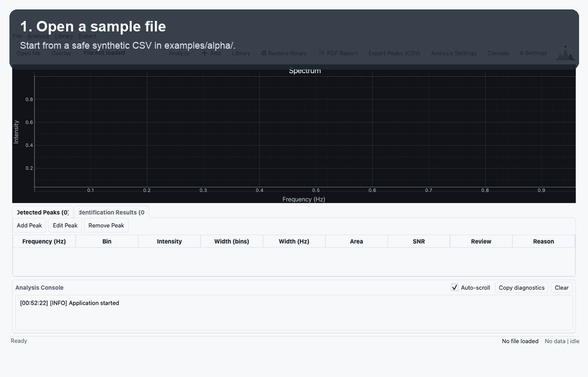

<p align="right"><a href="README.md">English</a> | <a href="README.ja.md">日本語</a></p>

<p align="center">
  
</p>

<h1 align="center">ChromaTsvet</h1>

<p align="center">
  Десктопное приложение для загрузки, обработки, визуализации и идентификации
  спектральных данных и хроматограмм.
</p>

<p align="center">
  <a href="https://github.com/pinkprincess766/ChromaTsvet/actions/workflows/ci.yml"></a>
  
  
  
  <a href="LICENSE"></a>
</p>


## Быстрая демонстрация



Демонстрация использует только синтетические данные из `examples/alpha/`. Она
показывает базовый путь тестера: открыть sample-файл, запустить анализ,
проверить пики на графике и в таблице, затем экспортировать отчёт.

ChromaTsvet объединяет десктопный интерфейс на PyQt и вычислительное ядро
обработки сигналов на Rust/PyO3. Проект задуман как практичная и проверяемая
основа для научного анализа сигналов, а не как непрозрачный процесс обработки.
Название отсылает к Михаилу Семёновичу Цвету, ботанику и создателю
хроматографии.

## Статус проекта

ChromaTsvet v0.3.0 — alpha-релиз с фокусом на воспроизводимость анализа,
переносимость reference library и более простой вход для тестеров. Приложение
можно запускать из исходного кода, а для GitHub Releases теперь можно собирать
скачиваемые macOS/Windows app archives. ChromaTsvet уже подходит для локальных
экспериментов, демонстраций и итеративной разработки научных инструментов, но
пока не является сертифицированным лабораторным прибором.

Для закрытого alpha-тестирования см. [Alpha Testing Guide](docs/testing_guide.md).
В нём есть безопасные синтетические файлы, чеклист ручной проверки и инструкции
по оформлению отчётов об ошибках.

CI запускает Python- и Rust-тесты. Python-тесты теперь используют pytest, а в
проект добавлены детерминированные синтетические спектры для регрессионных
проверок поиска пиков. Идентификация по пикам доступна как прозрачная базовая
реализация; старое косинусное сравнение сохранено как fallback для совместимости.

## Что нового в v0.3

v0.3 делает результаты анализа проще для проверки, повторения, передачи и
тестирования.

**Воспроизводимость анализа:**

- Processing Passport добавлен в экспортируемые отчёты.
- Analysis session bundles сохраняют file-independent snapshot результата анализа.
- Method presets помогают переиспользовать настройки поиска пиков.

**Peak review и reference libraries:**

- Peak Review помогает проверять accepted, rejected, manual и warning-heavy пики.
- Доступно ручное добавление, редактирование и удаление пиков.
- Reference libraries можно импортировать и экспортировать как переносимые JSON/CSV с обработкой дубликатов.

**Дистрибуция и тестирование:**

- Для GitHub Releases можно собирать macOS и Windows desktop archives.
- Добавлены README workflow GIF и onboarding-документация для тестеров.
- Архитектурные границы стали явнее: UI, экспорт, analysis state и reference persistence разделены лучше.

## Возможности

- Загрузка числовых спектральных или хроматографических данных из CSV и TXT.
- Median- и Savitzky-Golay-фильтрация, опциональное сглаживание спектра и baseline correction.
- Расчёт FFT-спектра с настраиваемым sample rate и частотной осью.
- Нормализация спектра по интегральной площади, когда нужно сравнимое масштабирование интенсивности.
- Поиск пиков с настройками threshold, prominence, distance и SNR; расчёт frequency, intensity, FWHM width в bins/Hz, Gaussian area и SNR.
- Просмотр найденных пиков на графике и в подробной таблице анализа.
- Масштабирование спектра мышью.
- Наложение второго проанализированного спектра на текущий график для визуального сравнения.
- Повторное открытие недавних файлов, переиспользование последней директории и горячие клавиши.
- Сохранение и загрузка analysis session bundles без встраивания приватных путей к исходным файлам.
- Method presets для повторяемых настроек анализа.
- Peak Review, ручное добавление пиков, редактирование metadata и исключение rejected пиков из экспорта.
- Сравнение спектров с локальной SQLite-библиотекой эталонов и управление сохранёнными записями.
- Импорт и экспорт reference-library records в переносимых JSON или CSV.
- Экспорт найденных пиков с метаданными анализа в CSV и полных результатов анализа в PDF, HTML или Excel.
- Экспорт текущего графика спектра в PNG или SVG.
- Светлая и тёмная темы приложения.

## Скриншоты

<table>
  <tr>
    <td width="50%"><strong>Настройки анализа</strong></td>
    <td width="50%"><strong>Найденные пики</strong></td>
  </tr>
  <tr>
    <td></td>
    <td></td>
  </tr>
  <tr>
    <td colspan="2"><strong>PDF-отчёт анализа</strong></td>
  </tr>
  <tr>
    <td colspan="2" align="center"></td>
  </tr>
</table>

Релизные скриншоты используют детерминированный демонстрационный сигнал с
компонентами на 95 Hz, 240 Hz и 410 Hz. Их можно пересоздать командой
`tools/capture_release_screenshots.py`; PNG-файлы предназначены для README и
GitHub release notes. Для повторной генерации превью PDF нужен либо `pypdfium2`,
либо Poppler `pdftoppm`.

## Скачать приложение

Для GitHub Releases в v0.3 можно собирать готовые desktop archives:

```text
ChromaTsvet-v0.3.0-macos-<architecture>.zip
ChromaTsvet-v0.3.0-windows-<architecture>.zip
SHA256SUMS-<platform>.txt
```

Скачайте архив для своей платформы из релиза и распакуйте его. На macOS откройте
`ChromaTsvet.app`. На Windows откройте `ChromaTsvet.exe` из распакованной папки
`ChromaTsvet`. Текущая macOS-сборка не подписана и не notarized, поэтому macOS
может показать предупреждение безопасности при первом запуске. Если архив был
получен не через GitHub Releases, проверьте его по соответствующему
`SHA256SUMS`-файлу.

Запуск из исходного кода остаётся основным способом для разработки и для
платформ, где packaged app ещё нет.

## Быстрый старт

### Требования

- Python 3.9 или новее
- Актуальный Rust toolchain с Cargo
- Системные build tools, необходимые для PyO3

### Сборка и запуск из исходного кода

```bash
git clone https://github.com/pinkprincess766/ChromaTsvet.git
cd ChromaTsvet

make setup
make doctor
make run
```

`make setup` создаёт `.venv`, устанавливает Python-зависимости для разработки и
собирает Rust/PyO3-расширение через maturin.

Если `make` недоступен, используйте тот же workflow напрямую через Python:

```bash
python scripts/dev.py setup
python scripts/dev.py doctor
python scripts/dev.py run
```

Установленная консольная команда `chromatsvet` — рекомендуемый способ запуска
приложения. Исторический прямой запуск скрипта также поддерживается:

```bash
python python_analyzer/main.py
```

На Windows удобнее использовать Python helper:

```bat
py scripts\dev.py setup
py scripts\dev.py doctor
py scripts\dev.py run
```

Приложение стартует без демоданных; используйте **Open file**, чтобы загрузить
CSV- или TXT-спектр.

Для проверки импорта, анализа, графиков и экспорта без приватных данных можно
использовать синтетические примеры из `examples/alpha/`.

### Первый smoke test для тестера

Для первой проверки используйте безопасные синтетические данные:

1. Запустите приложение через `make run` или `python scripts/dev.py run`.
2. Откройте `examples/alpha/clean_three_peaks.csv`.
3. Убедитесь, что анализ выполняется, а найденные пики появляются на графике и в таблице.
4. Экспортируйте один отчёт, лучше PDF или HTML, и проверьте, что в нём совпадают имя файла, настройки и количество пиков из приложения.

Полный чеклист закрытого alpha-тестирования находится в [Alpha Testing Guide](docs/testing_guide.md).

## Входные данные

Самый простой поддерживаемый файл содержит одно значение интенсивности в строке:

```text
intensity
0.12
0.35
1.42
0.48
```

Также поддерживаются двухколоночные файлы без заголовка; в этом случае второй
столбец интерпретируется как интенсивность. Именованные столбцы вроде
`intensity`, `amplitude`, `signal`, `value` или `absorbance` определяются
автоматически. CSV-файлы могут использовать запятую, точку с запятой или tab в
качестве разделителя.

После загрузки файла задайте корректный sample rate в **Analysis Settings**. Он
нужен для преобразования бинов FFT в физические значения частоты.

## Типичный рабочий процесс

1. Откройте CSV- или TXT-файл сигнала.
2. Настройте sample rate, фильтрацию, сглаживание спектра, baseline correction и параметры поиска пиков.
3. Запустите анализ и проверьте отмеченные пики на частотном графике.
4. При необходимости загрузите overlay-спектр для визуального сравнения.
5. Просмотрите frequency, intensity, width в bins/Hz, area и SNR в таблице результатов.
6. Экспортируйте список пиков в CSV или сформируйте отчёт анализа в PDF, HTML или Excel.

## Разработка

Для разработки и тестов установите опциональные зависимости:

```bash
make setup
```

Запуск Python-тестов из корня проекта:

```bash
make test
```

Запуск Rust unit tests:

```bash
make rust
```

`make check` запускает оба набора тестов. Низкоуровневые команды всё ещё можно
использовать напрямую: `QT_QPA_PLATFORM=offscreen python -m pytest -v` и
`cargo test --manifest-path rust_module/Cargo.toml`.

Запуск детерминированных регрессионных тестов на синтетических спектрах:

```bash
QT_QPA_PLATFORM=offscreen python -m pytest tests/unit/test_synthetic_peak_detection.py -v
```

Перегенерация PNG-скриншотов для v0.3:

```bash
QT_QPA_PLATFORM=offscreen python tools/capture_release_screenshots.py
```

Перегенерация workflow GIF для README:

```bash
QT_QPA_PLATFORM=offscreen python tools/capture_readme_demo_gif.py
```

См. [Development Notes](docs/development.md) для текущего процесса сборки через
maturin и процедуры performance profiling. См. [Peak-Based Identification](docs/identification.md)
для текущего сопоставления по пикам и legacy cosine fallback.

Сборка release app archive для текущей платформы:

```bash
python tools/build_release_app.py
```

Готовые zip и checksum будут записаны в `release_artifacts/v0.3.0/`. Эта папка
игнорируется git и нужна только как staging area для загрузки файлов в GitHub
Release. Windows archive нужно собирать на Windows; если работаешь с macOS,
используй ручной GitHub Actions workflow `Release Artifacts`.

## Архитектура

```text
python_analyzer/
  main.py                    Тонкий bootstrap и compatibility facade
  gui/main_window.py         Оркестрация MainWindow, состояние, экспорт
  gui/dialogs.py             Диалоги настроек, анализа и логов
  gui/error_messages.py      Вспомогательные функции для сообщений об ошибках
  gui/recent_files.py        Recent Files и запоминание последней директории
  gui/reference_library.py   Диалог управления reference library
  gui/peak_editor.py         Диалог ручного добавления/редактирования пиков
  gui/theme.py               Помощники для Qt palette и stylesheet
  gui/log_view.py            Общее форматирование log view
  analysis/models.py         Dataclasses AnalysisSettings и LoadedSpectrum
  analysis/runner.py         Обёртка pipeline Filter -> Rust
  analysis/method_presets.py Reusable analysis method presets
  analysis/peak_review.py    Статусы и диагностика Peak Review
  analysis/session_bundle.py Переносимые snapshots analysis session
  analysis/processing_passport.py
                             Processing metadata для exports
  analysis/windowing.py      Имена, labels и validation для FFT window
  exporters/excel_report.py  Экспорт книги Excel
  exporters/html_report.py   Экспорт самодостаточного HTML-отчёта
  exporters/pdf_report.py    Генерация PDF-отчёта
  exporters/peak_csv.py      Экспорт найденных пиков в CSV
  readers/spectrum_reader.py Парсинг CSV/TXT-спектров
  viz/spectrum_plot.py       График спектра, частотная ось, peak markers
  core/identification.py     SQLite-backed reference matching
  core/reference_library_io.py
                             Portable reference import/export
  core/reference_repository.py
                             SQLite reference persistence

rust_module/src/
  lib.rs                     PyO3 analysis pipeline
  types.rs                   Типы результата, видимые из Python
  signal/filters.rs          Фильтры и baseline correction
  signal/fft.rs              FFT и расчёт частотной оси
  signal/normalization.rs    Integral-area normalization
  signal/peak_detection.rs   Метрики и поиск пиков
  signal/window.rs           FFT window functions

tests/
  conftest.py                Общие pytest fixtures
  support/synthetic_spectra.py
                             Синтетические спектры и helpers для peak matching tests
  unit/                      Unit- и focused regression tests
```

Python отвечает за работу с файлами, desktop UI и отчёты. Rust отвечает за
численный pipeline и возвращает обработанный спектр, частотную ось и структуры
пиков через PyO3.

## Область v0.3 и roadmap

Версия 0.3 усиливает воспроизводимость, reviewability и release readiness вокруг
уже существующей основы анализа. Приложение умеет загружать данные, настраивать
анализ через GUI, визуализировать и экспортировать результаты, сохранять
пользовательские настройки, открывать недавние файлы, сохранять analysis
sessions, проверять и вручную корректировать пики, переносить reference libraries
между машинами и создавать PDF, HTML, Excel, PNG, SVG и CSV со списком пиков.
Результаты peak-based matching сохраняют списки совпавших и несовпавших пиков,
показывают покрытие, ошибку по частоте и консервативный уровень доказательности
для проверки кандидата пользователем.

Следующие приоритеты разработки: репрезентативные наборы данных для валидации
эталонов, более плотная обратная связь от реальных тестеров, кроссплатформенные
подписанные/notarized сборки и более широкие синтетические и реальные
регрессионные наборы данных. Модель идентификации и ограничения evidence-оценки
описаны в [Peak-Based Identification](docs/identification.md).

## Известные ограничения

ChromaTsvet всё ещё является **alpha** научным ПО. Он полезен для экспериментов,
проверки данных, разработки и образовательных задач, но **не является
сертифицированным лабораторным прибором**.

- Идентификация по пикам и сценарии работы с библиотекой эталонов всё ещё развиваются.
- macOS app archives пока не подписаны и не notarized; packaged builds для Linux ещё нет.
- Японская документация ([README.ja.md](README.ja.md)) может временно отставать от английского и русского README.

## Лицензия

ChromaTsvet распространяется под [MIT License](LICENSE).
